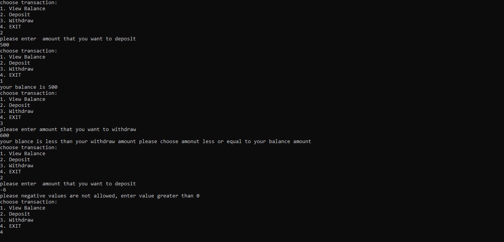

# Lab2-ATM

### This program mocks the main functionality of an ATM bank transactions:
 * #### View Balance():  will show the current balance, balance should be more than 0.
 * #### Deposit(): will adds money to the balance, money amount should be more than 0.
 * #### Withdraw(): will subtract money from the balance, withdraw should be more than 0 and not greater than balance.
### Program looks like:

### Program contains Unit Test, test the functionality for the methods